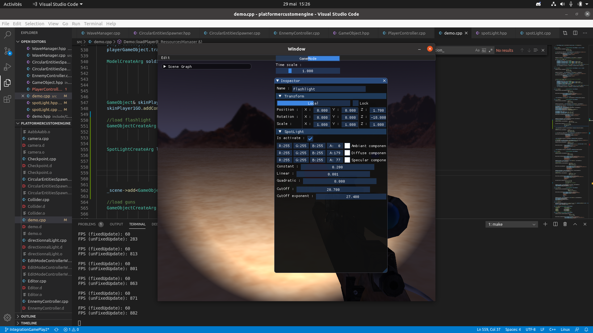
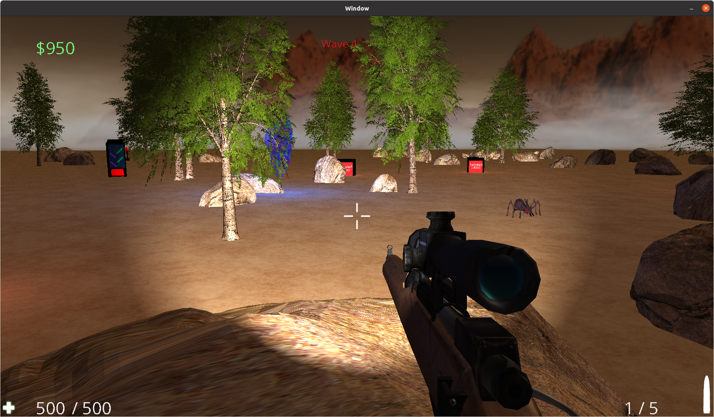
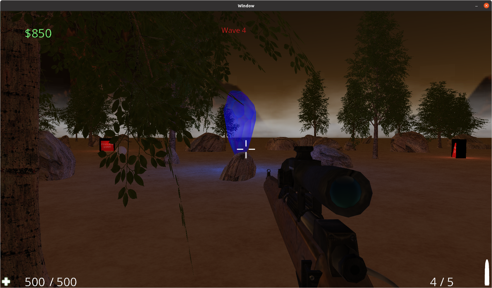
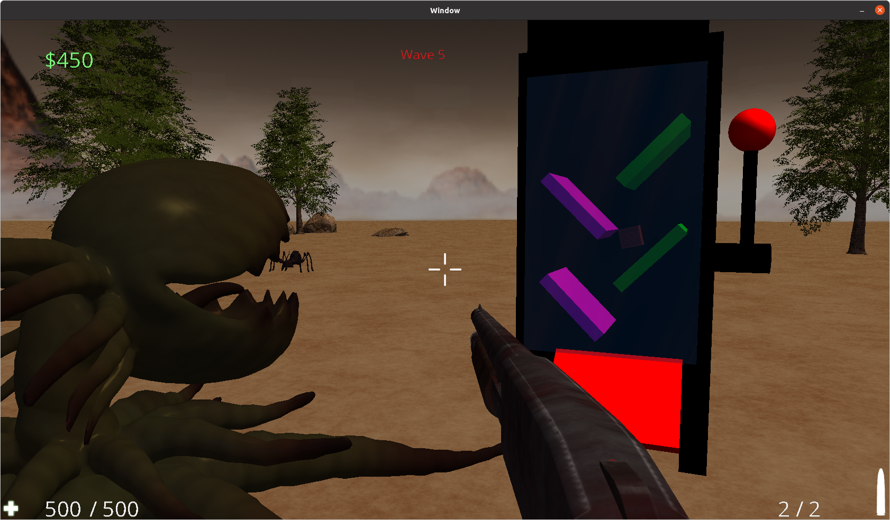

# Projet FPS avec moteur de jeu OpenGl3.3/SDL2.0
> Gavelle Anthony, Nisi Guillaume, Six Jonathan
> Juin 2020

## Summary
- [Description](##Description "Goto description part")
- [Commandes](##Commandes "Goto command part")
- [Comment compiler](##Comment-compiler "Goto compil part")
- [Comment éxécuter](##Comment-executer "Goto launch part")
- [Bug](##Bug "Goto bug part")
- [Aspect technique](##Aspect-technique "Goto technical part")

## Description

Vous êtes seul dans une plaine désertique à défendre le coeur de ce lieu, un cristal aussi appelé "nexus". Des vagues d'ennemies essayerons de vous envahir afin de consommer l'essence du cristal. A vous de défendre ce lieu, de jour comme de nuit ! Qui sait ce qu'il pourrait arriver si ce cristal venait à s'éteindre... 






## Commandes

### Clavier :
Les commandes sont réglables via le menu option du jeu. Par défaut :

Commande 		| Action
------------- 	| -------------
Q/Z/S/D         | Déplacer le joueur : gauche/haut/bas/droite
Espace        	| Sauter / Monter en caméra éditeur
Clic gauche     | Tirer
Clic droit      | Viser (pour le sniper)
molette         | Changer d'arme
R               | Recharger
F               | Utiliser la machine à butin
Esc             | Pause/Quitter
F1 				| Utiliser l'éditeur du moteur (graphe de scene, inspector, camera éditeur...)
F2 				| Switch 3eme personne/1er personne
ctrl            | Descendre en camera éditeur

## Comment compiler
Ouvrez un terminal et taper la commande suivante :

```
make
```
Vous pouvez également compiler en multi-thread via la commande
```
make multi
```
D'autre commandes sont disponibles dans le fichier makefile

Les librairies suivantes sont nécéssaire :

lib OpenGL : 
- sudo apt-get install libglew-dev
- sudo apt-get install glew-utils

C, C++ compilateur
- sudo apt-get install gcc
- sudo apt-get install g++

lib SDL2
- sudo apt-get install libsdl2-dev
- sudo apt-get install libsdl2-ttf-dev
- sudo apt-get install libsdl2-image-dev

lib OpenAl :
- sudo apt-get install libopenal-dev
- sudo apt-get install libalut-dev

## Comment executer
Ouvrez un terminal à la racine du projet et tapez :
```
make run
ou
./bin/exe
```
/!\ Attention vous devez utiliser un terminal indépendant et non celui d'un IDE, sinon le son ne fonctionnera pas.

Il est possible de compiler le programme avec différent flags en modifiant directement le makefile :
- Pour la version debug avec editeur : CXX_DEBUG en c++ et C_DEBUG en C
- Pour la version release sans editeur : CXX_EDITOR en c++ et C_EDITOR en C
- Pour la version release avec editeur : CXX_BUILD en c++ et C_BUILD en C

## Bug

Tous les cas de collision n'ont pu être testé. La version actuelle est stable mais il peut y avoir certain cas particulier non détecté lors des playtests.

## Aspect technique

### Leak : 

La SDL ainsi que les autres librairies incluses dans le projet leak naturellement:
~ 6833 bytes définitivement perdu
~ 87373 bytes indirectement perdu  

### Performance :

Ce projet tourne entre 40 et 60 FPS en moyenne (Intel i5 2 core, Nvidia 860M).

### Autre :

Projet fonctionnant grâce au librairies suivante :
- OpenGL en core profile
- SDL2.0
- ImGui
- STB_image
- OpenAl
- RapidXML

Moteur physique réalisé grâce à nos propres libraires de mathématique. Ce moteur est conçu en suivant l'architecture ECS (Entity-Components-System) et reprend certaines interfaces inspirées par le moteur Unity.

- Time manager (possède un system de fixed update et unfixed update pour les calculs de physique. Possibilité d'utiliser un time scale pour accélerer ou ralentir le temps)
- Input manager
- Variadique template ressource manager
- Système sonore (Utilisant OpenAL et ne lisant que les fichier WAV)
- Parseur de MTL et fichier OBJ (ne retourne qu'une seule mesh)
- Fichier de log si le dossier "log" est créé
- Système de Transform, gameObject et Component
- Billboard (entité toujours face à la caméra)
- Ecran scindé possible (non intégré dans le jeu)
- Textes (avec SDL_TTF)
- Skybox
- Pré-construction des shaders avec tris des informations envoyé en fonction
- Multi texturing et multi matériaux pour les meshs
- Lumière fonctionnant avec l'agorithme Blinn-Phong
- Générateur de particules et de décals
- Sauvegarde des prefabs et des scènes en XML
